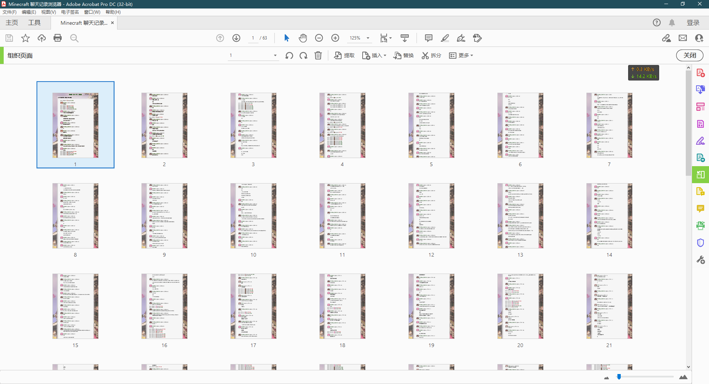

# minecraft-chat-history-browser
MC 服务器聊天记录浏览器

### 1 概述

如果你开过MC服务器，你会发现服务器的日志文件里面会包含玩家的活动记录，此工具可以帮助你高效浏览这些记录，甚至生成PDF来分享

如图所示：

### 2 使用方法

下载 [Release](https://github.com/wifi504/minecraft-chat-history-browser/releases/latest)，解压后双击 `start.bat` 运行：

看到此界面，启动成功，打开浏览器访问 [http://localhost:25566/](http://localhost:25566/) 即可使用

### 3 开源协议

本项目基于协议 GNU General Public License v3.0 开源

- 头像生成参考：[MCCAG](https://github.com/MCCAG) - GPL-3.0 license
